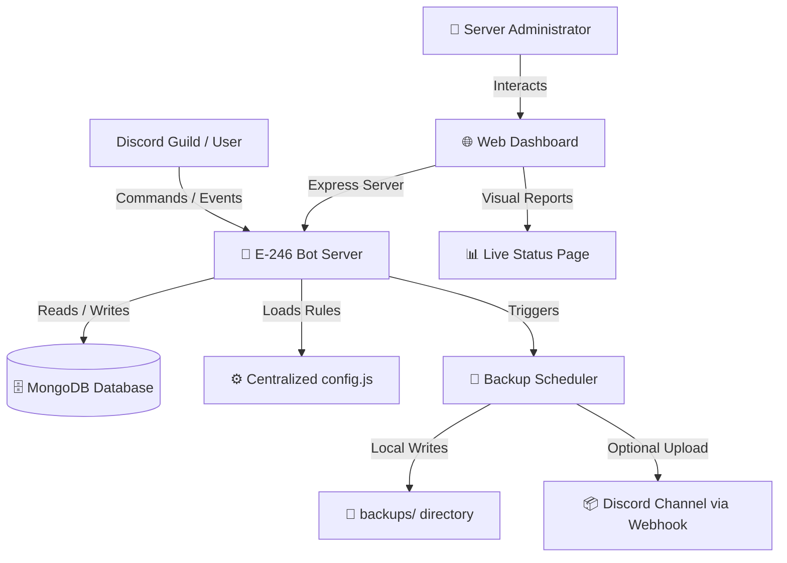

<div align="center">

# E-246 System — ديسكورد بوت متكامل للإنتاج والبرودكشن

   

ديسكورد بوت احترافي متكامل مصمم للإنتاج، يحتوي على لوحة تحكم ويب متجاوبة، قاعدة بيانات مدمجة، فحص أمان للمتغيرات، نسخ احتياطي تلقائي، وإدارة كاملة لسيرفرك باحترافية كاملة.

</div>

---

> [!IMPORTANT]
> **ملاحظة هامة:** تأكد من إعداد جميع المتغيرات في ملف `.env` بشكل صحيح وتفعيل صلاحيات الـ Gateway Intents كاملة في بوابة المطورين (Discord Developer Portal) قبل تشغيل البوت لتفادي أي أخطاء في الاتصال.

---

## 🏗️ بنية وتدفق النظام (System Architecture)

يوضح المخطط البياني التالي التفاعل الديناميكي بين البوت، قاعدة البيانات، الجدولة، ولوحة تحكم الويب:



---

## المميزات الرئيسية والإنتاجية (Production Features)

- **⚙️ توحيد إعدادات البوت والتحكم المركزي ([config.js](file:///c:/Users/Enzo/Desktop/E-246/config.js)):** حصر جميع متغيرات البوت، الألوان، مهدئات السبام، وخيارات الألعاب في ملف تهيئة رئيسي موحد لتسهيل التخصيص.
- **🛡️ حماية الأوامر من السبام (Slash Commands Rate-Limiter):** تحديد سرعة تنفيذ الأوامر للأعضاء لمنع تعليق البوت أو حظره من قبل Discord API (مع استثناء المشرفين تلقائياً).
- **💾 النسخ الاحتياطي التلقائي وسحابة ديسكورد (Automated Backups):** نظام مدمج لجدولة نسخ MongoDB الاحتياطية يومياً محلياً في مجلد `backups/` مع إرسالها تلقائياً كملفات مرفقة آمنة لقناتك الخاصة عبر Webhook.
- **📊 لوحة صحة البوت والخادم (Live Status Page):** واجهة ويب متطورة تفاعلية باللوحة لعرض استهلاك الرام، المعالج، الـ Uptime وحالة اتصال MongoDB ومخدمات الصوت Lavalink.
- **🚀 ملف تشغيل PM2 للتشغيل المستمر ([ecosystem.config.js](file:///c:/Users/Enzo/Desktop/E-246/ecosystem.config.js)):** تهيئة كاملة لإدارة وتشغيل البوت في الخلفية لضمان عدم توقفه وإعادة تشغيله تلقائياً في حال انهياره.
- **🔍 فحص صارم لبيئة العمل قبل الإقلاع ([envValidator.js](file:///c:/Users/Enzo/Desktop/E-246/utils/envValidator.js)):** إيقاف فوري للتشغيل وحظر الإقلاع في حال وجود أي نقص بمتغيرات ملف الـ `.env` لتجنب الأخطاء التشغيلية.
- **💅 توحيد التنسيق تلقائياً (Prettier):** تهيئة كاملة لضمان كتابة وتنسيق الأكواد بشكل موحد وجميل عبر كامل ملفات المشروع.

---

## قائمة الأقسام والأوامر

| القسم                | الأوامر                                                            | الوصف                                            |
| :------------------- | :----------------------------------------------------------------- | :----------------------------------------------- |
| **الإدارة والسجن**   | `/ban`, `/kick`, `/timeout`, `/warn`, `/jail`, `/bc`               | معاقبة المخالفين وسجنهم وبث الرسائل              |
| **البنك والاقتصاد**  | `/bank`                                                            | العمليات المالية، القروض، الاستثمار والمقامرة    |
| **الألعاب والتسلية** | `/faster`, `/bomb`, `/mafia`, `/button`, `/chairs`                 | ألعاب تفاعلية وسرعة بديهة بنظام Canvas           |
| **المستويات**        | `/rank`, `/topmessages`, `/topvoice`, `/topreactions`, `/settings` | نظام النقاط والترقيات الصوتي والكتابي            |
| **التذاكر**          | `/ticket-setup`, `/ticket`, `/open`, `/close`, `/delete`           | الدعم الفني وإدارة بطاقات المساعدة               |
| **الدعوات**          | `/invites`, `/info`, `/addrank`, `/setlogs`                        | تتبع إحصائيات دعوات الأعضاء                      |
| **الأتمتة والبوست**  | `/autoline`, `/autotax`, `/autoboost`, `/autoreply`                | تشغيل الفواصل والضريبة التلقائية وشكر البوست     |
| **الحماية**          | `/setup`, `/setlimits`, `/whitelist`, `/unwhitelist`               | إعداد الحماية وحماية السيرفر من التخريب          |
| **العامة**           | `/user`, `/avatar`, `/banner`, `/server`, `/help`, `/system`       | معلومات الأعضاء والسيرفر والملفات ومراقبة النظام |

---

## متطلبات التشغيل والبدء السريع

1. **تثبيت الحزم المطلوبة:**

   ```bash
   npm install
   ```

2. **تهيئة ملف الإعدادات (`.env`):**
   قم بتهيئة ملف `.env` في المسار الرئيسي بالبيانات التالية:

   ```env
   DISCORD_TOKEN=توكن_البوت
   CLIENT_ID=معرف_البوت
   GUILD_ID=معرف_السيرفر_للتجربة
   CLIENT_SECRET=سيكرت_البوت
   PORT=3000
   CALLBACK_URL=http://localhost:3000/auth/callback
   DISABLE_DASHBOARD=false
   OWNER_ID=ايدي_مالك_البوت
   MONGODB_URI=رابط_قاعدة_بيانات_مونجو
   BACKUP_WEBHOOK_URL=رابط_ويب_هوك_ديسكورد_للنسخ_الاحتياطي
   ```

3. **تشغيل البوت في الخلفية (PM2):**
   ```bash
   pm2 start ecosystem.config.js
   ```

---

<div align="center">
  <b>صنع بالكثير من القهوة بواسطة اينزو</b><br>
  <sup>جميع الحقوق محفوظة &copy; 2026 EnzoCord</sup>
</div>
